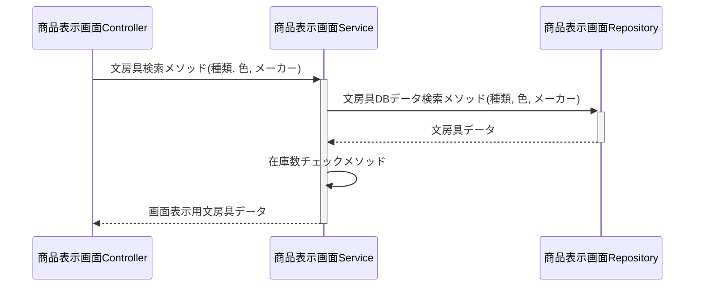

```mermaid
sequenceDiagram
participant goodsController as 商品表示画面Controller
participant goodsService as 商品表示画面Service
participant goodsRepository as 商品表示画面Repository

goodsController ->>+ goodsService: 文房具検索メソッド(種類, 色, メーカー)
    goodsService ->>+ goodsRepository : 文房具DBデータ検索メソッド(種類, 色, メーカー)
    goodsRepository　-->>- goodsService : 文房具データ
    goodsService　->> goodsService : 在庫数チェックメソッド
goodsService　-->>- goodsController : 画面表示用文房具データ
```
